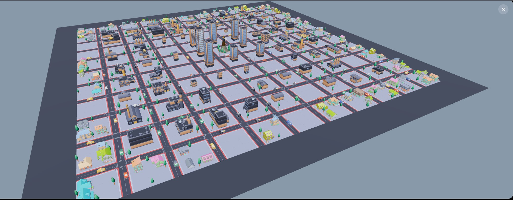

# TweetCity

Turn an X account into a living 3D city NFT on Mantle.



TweetCity mints a generative city from a user's X profile, stores AI-created city metadata on IPFS, and lets cities trade verified social engagement through on-chain gift markets.

Live app: https://tweetcity.fun  
Network: Mantle Sepolia Testnet

## What It Does

- Mints a city NFT from an X account after OAuth verification.
- Uses profile metrics to shape the city: followers, tweets, following, engagement, and likes.
- Uses AI to generate the city's name, style, motto, lore, and color palette.
- Renders each city as an interactive 3D scene with roads, buildings, vehicles, citizens, and gift installations.
- Lets city owners set prices for six gift actions.
- Supports two marketplace flows:
  - City Administrator: buy a gift from a city owner and pay on-chain escrow.
  - City Resident: fund a reward campaign so other verified city owners can complete social actions and claim payouts.
- Includes owner/admin tools for contract operations, gift verification, city moderation, backend diagnostics, and V2 city previews.

## Gift Types

| Gift | Social action |
| --- | --- |
| Graffiti | Like |
| Street Art | Like + repost |
| Flag | Comment |
| Billboard | Quote post |
| Monument | Dedicated mention post |
| District | Pinned post campaign |

## Security Model

- X linking is bound to wallet signatures.
- OAuth tokens are encrypted at rest with `OAUTH_TOKEN_ENCRYPTION_KEY`.
- One X account maps to one canonical city, preventing duplicate mint abuse.
- City gift funds are held in `CityGifts` escrow until verified, refunded, withdrawn, or cancelled.
- Resident reward campaigns prevent duplicate claims by both wallet and X handle.
- Admin endpoints require owner wallet authentication.
- Backend uses rate limits, small JSON body limits, Helmet, and trusted reverse proxy handling.

## Contracts

TweetCity NFT proxy:

```text
0x1d27d3E227F75Ba64E295205B66B2756A5A6f096
```

CityGifts UUPS proxy:

```text
0x1F672C3da27a50261524dAbb0FF957f49202c3F3
```

Chain:

```text
Mantle Sepolia Testnet, chainId 5003
```

## Tech Stack

- Solidity, Hardhat, OpenZeppelin UUPS upgrades
- Mantle Sepolia
- React, Vite, Tailwind CSS
- Three.js, React Three Fiber, Drei
- Express.js backend
- X OAuth 2.0 / PKCE
- Claude API for city personality generation
- Pinata/IPFS for metadata
- AWS EC2, Nginx, PM2, GitHub Actions deploy

## Repository Layout

```text
contracts/          Solidity contracts
test/               Hardhat tests
scripts/            Deploy and upgrade scripts
backend/            Express API, OAuth, oracle, storage
frontend/           React app and 3D renderer
docs/               Product and operations notes
.github/workflows/  AWS deployment workflow
```

## Local Setup

Install root contract dependencies:

```bash
npm install
```

Install backend:

```bash
cd backend
npm install
cp .env.example .env
```

Install frontend:

```bash
cd frontend
npm install
cp .env.example .env
```

Minimum backend environment:

```env
PORT=3001
FRONTEND_URL=http://localhost:5173
OAUTH_DATA_DIR=./data
OAUTH_TOKEN_ENCRYPTION_KEY=generate_32_plus_random_chars

TWITTER_CLIENT_ID=
TWITTER_CLIENT_SECRET=
TWITTER_OAUTH_CALLBACK_URL=http://localhost:3001/auth/twitter/callback

ANTHROPIC_API_KEY=
PINATA_API_KEY=
PINATA_SECRET_KEY=

ORACLE_PRIVATE_KEY=
MANTLE_TESTNET_RPC=https://rpc.sepolia.mantle.xyz
CONTRACT_ADDRESS=0x1d27d3E227F75Ba64E295205B66B2756A5A6f096
GIFTS_CONTRACT_ADDRESS=0x1F672C3da27a50261524dAbb0FF957f49202c3F3
```

Frontend environment:

```env
VITE_API_URL=http://localhost:3001
```

Run backend:

```bash
cd backend
npm run dev
```

Run frontend:

```bash
cd frontend
npm run dev
```

## Tests

Run contract tests:

```bash
npx hardhat test
```

Build frontend:

```bash
cd frontend
npm run build
```

Backend syntax checks:

```bash
node --check backend/src/index.js
node --check backend/src/routes/auth.js
node --check backend/src/routes/city.js
```

## Deployment

The production site is deployed to AWS EC2 with:

- Nginx serving `frontend/dist`
- PM2 running `backend/src/index.js`
- GitHub Actions workflow: `.github/workflows/deploy-aws.yml`

Required GitHub Actions secrets:

```text
EC2_HOST
EC2_USER
EC2_SSH_KEY
```

## Hackathon Notes

TweetCity was built for the Mantle Turing Test Hackathon 2026 as a consumer and viral social dApp. The core idea is simple: your social identity becomes a playable, tradeable city, and verified social engagement becomes programmable on-chain commerce.
